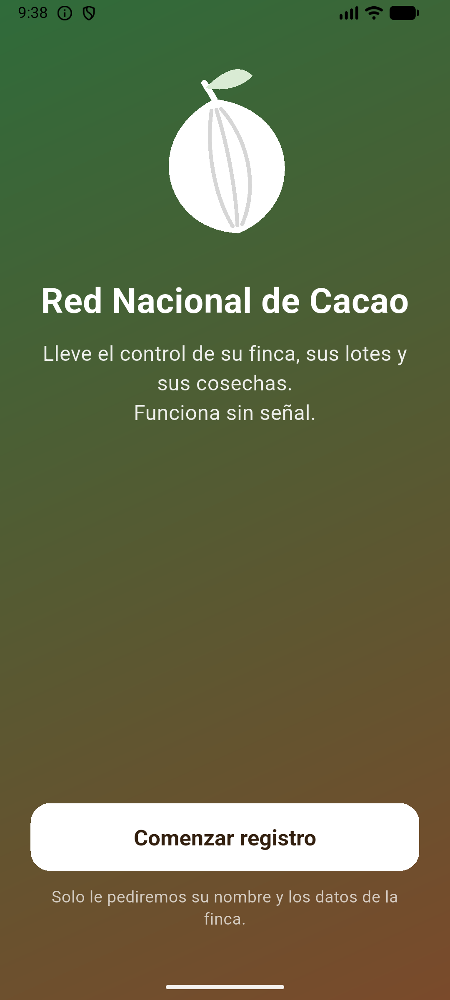
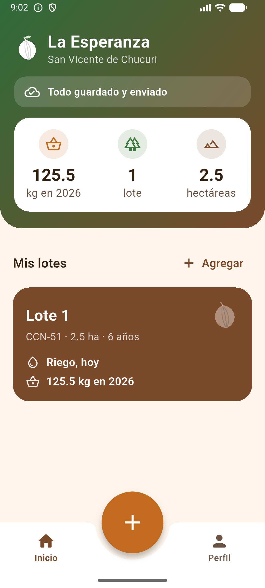
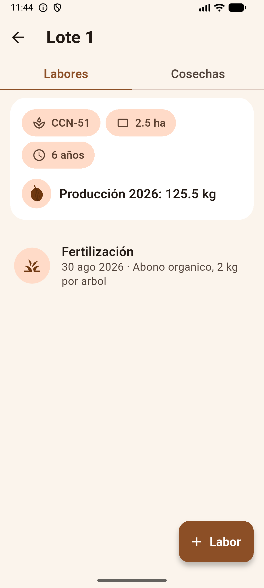
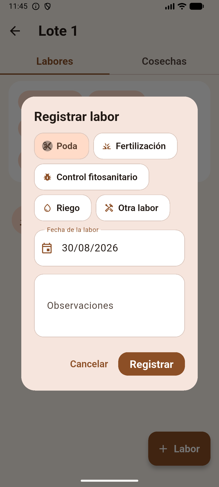
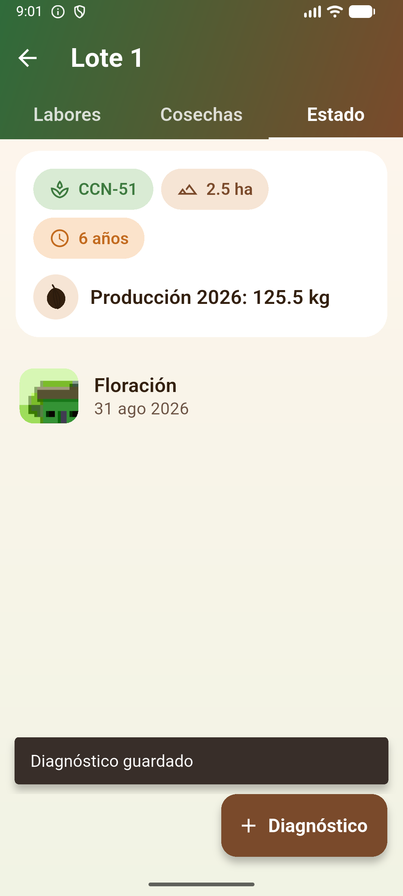
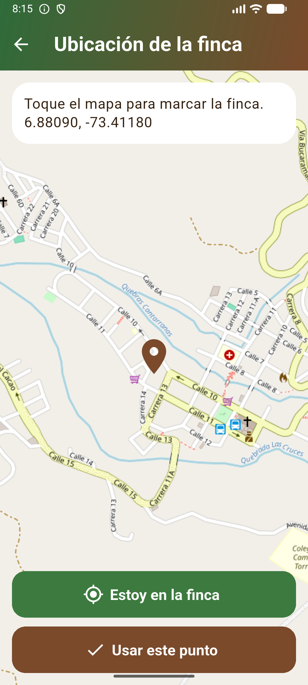
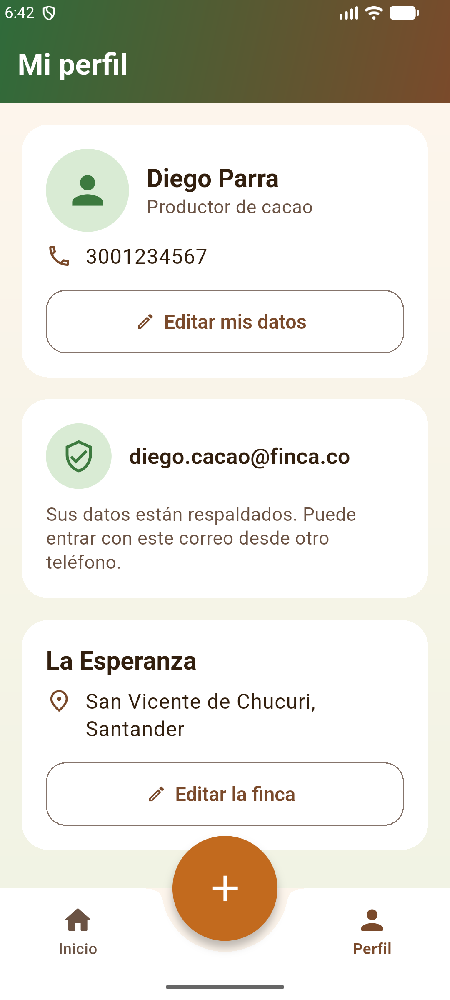
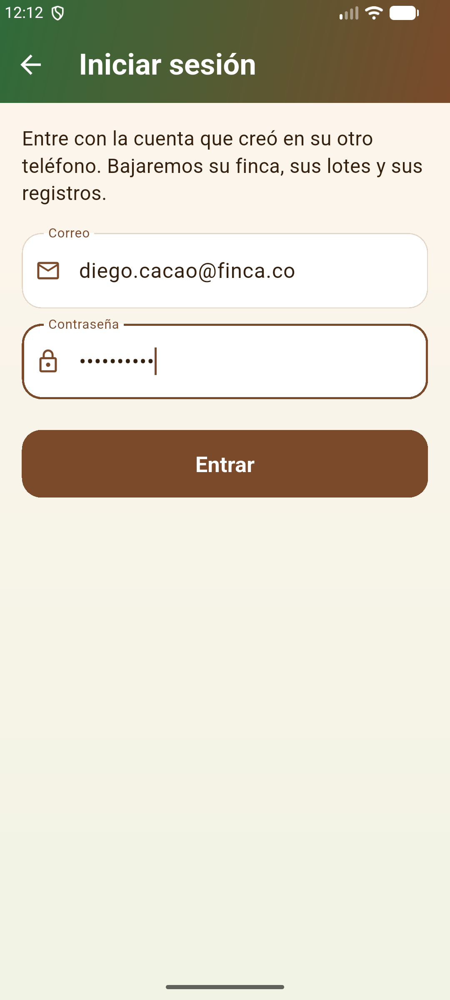

# Red Nacional de Cacao

Aplicación móvil para que un **productor de cacao** lleve el control de su finca
desde el celular, **en el campo y sin señal**.

Proyecto de seminario de grado desarrollado con el SENA / Tecnoparque, como
primer paso del ecosistema digital de la Red Nacional de Cacao.

| | |
|---|---|
| **Estado** | Fase 1 cerrada (captura local + sincronización + cuentas) |
| **Plataforma** | Android · Web (iOS preparado, sin compilar todavía) |
| **Tecnología** | Flutter · Drift/SQLite · Google Apps Script + Sheets |
| **Tests** | 121, todos en verde |

---

## 1. Qué problema resuelve

El productor de cacao anota hoy sus labores y cosechas en cuadernos o no las
anota. Cuando llega el técnico del SENA o de FEDECACAO, no hay historial: no se
sabe cuándo se podó, cuánto se cosechó ni cómo viene el lote.

Esta aplicación reemplaza ese cuaderno, con una condición que manda sobre todo lo
demás: **en la finca no hay señal**. Por eso todo se guarda primero en el
teléfono y se sincroniza después, cuando haya internet.

**Para quién es:** productores de cacao, con celulares de gama baja o media, que
usan la app de pie, al sol y con las manos ocupadas. De ahí que todo sea grande y
que haya poco texto en pantalla.

### Qué se puede registrar

```
Productor
 └── Fincas              (nombre, municipio, departamento, ubicación GPS)
      └── Lotes          (variedad, área, fecha de siembra)
           ├── Actividades   (poda, fertilización, control fitosanitario, riego, otra)
           ├── Cosechas      (kilos y fecha)
           └── Diagnósticos  (estado fenológico, notas y foto)
```

---

## 2. Características implementadas

- Registro y edición de **productor**, **finca** y **lotes**.
- Registro de **labores**, **cosechas** y **diagnósticos** por lote.
- **Ubicación de la finca** con mapa (OpenStreetMap) y con el GPS del teléfono.
- **Foto del cultivo** en los diagnósticos (cámara o galería).
- **Producción anual** calculada en vivo, por lote y por finca.
- **Última labor** de cada lote a la vista en el inicio ("Poda, hace 12 días").
- **Borrado suave con cascada**: borrar un lote arrastra sus registros y nada se
  borra físicamente.
- **Funcionamiento sin internet** de toda la app.
- **Anotar rápido**: la labor se registra con solo el tipo (seis botones grandes
  con ícono) y la fecha; lo demás va en "Agregar más detalles". La edad del
  cultivo no se pregunta: se calcula con la fecha de siembra.
- **Palabras del campo** en los formularios ("¿Cuántos árboles podó?",
  "Abonar") y **dictado por voz** en las observaciones.
- **Recordatorios** en el Inicio ("El Alto lleva 95 días sin poda") y
  **comparación con el año pasado a la misma fecha**.
- **Foto de cada lote** (se queda en el teléfono).
- **Ubicación de la finca con el GPS** ("Estoy en la finca") o en el mapa, sin
  escribir coordenadas.
- Registro con la **cédula ya elegida** y el **nombre y correo de la cuenta de
  Google**.
- **Sincronización con la nube**: subida de cambios pendientes, descarga
  incremental, reglas de conflicto y cascadas remotas.
- **Cuenta con Google**: el productor entra con su cuenta de Google, que llega
  ya verificada; la app nunca ve ni guarda contraseñas.
- **Inicio de sesión** en otra instalación para recuperar los datos.
- **Cerrar sesión** y **cambiar de cuenta**, que borran los datos de ese
  teléfono avisando antes si hay cambios sin enviar.

Lo que **todavía no** está: fotos en la nube y compilación de iOS. Ver
[Estado del proyecto](#12-estado-del-proyecto).

---

> 📘 **¿Cómo está hecho por dentro?** El detalle técnico —decisiones,
> algoritmos, trampas y los problemas reales que aparecieron— está en
> [`docs/DOCUMENTACION_TECNICA.md`](docs/DOCUMENTACION_TECNICA.md).

## 3. Arquitectura

```
        Flutter (UI)
             │
        Repositories          PerfilRepository · LoteRepository
             │
    Base de datos local       Drift / SQLite  ← FUENTE DE VERDAD
             │
        SyncService           push → pull, cursor, conflictos
             │
         ApiRemota            (interfaz)
        ┌────┴─────┐
   ApiRemotaFalsa  ApiAppsScript
     (tests)            │
              Apps Script / Google Sheets
```

La aplicación es **offline-first**. Eso significa, en concreto:

1. La UI **nunca** espera al servidor. Guarda en local y sigue.
2. Cada fila escrita queda marcada como `pending`.
3. Cuando hay red, `SyncService` sube lo pendiente y baja lo nuevo.
4. Las filas ya sincronizadas quedan `synced`.

`ApiRemota` es una interfaz a propósito: los tests corren contra
`ApiRemotaFalsa` (un servidor en memoria, sin red) y la app real contra
`ApiAppsScript`. Cambiar de una a otra no toca la UI, ni los repositorios, ni los
DAOs, ni la lógica de sincronización.

---

## 4. Arquitectura de datos

Siete tablas de datos —`asociaciones`, `productores`, `fincas`, `lotes`,
`actividades_agricolas`, `cosechas`, `diagnosticos`— más dos de servicio:
`sesion` y `sync_meta`.

Todas las tablas de datos comparten el mixin `SyncColumns`:

| Columna | Para qué |
|---|---|
| `id` | **UUID generado en el dispositivo**, no autoincremental |
| `created_at` / `updated_at` | Reloj del teléfono |
| `deleted_at` | **Borrado suave**: la fila no se borra, se marca |
| `server_updated_at` | Sello que puso el servidor (único reloj comparable) |
| `sync_status` | `pending` · `synced` · `error` |
| `sync_error` | Motivo del último fallo de subida |

**Por qué UUID en el dispositivo:** dos teléfonos sin señal pueden crear
registros al mismo tiempo sin chocar cuando por fin sincronicen.

**Por qué borrado suave:** un teléfono que estuvo un mes sin señal tiene que
poder enterarse de que algo se borró. Un `DELETE` no deja rastro que propagar.

**Cascadas:** borrar un lote marca `deleted_at` en el lote **y** en sus
actividades, cosechas y diagnósticos, en una sola transacción, dejando todo
`pending` para que el borrado también viaje.

---

## 5. Sincronización

Cada pasada hace **push y después pull**, entidad por entidad y respetando las
dependencias:

```
productores → fincas → lotes → actividades · cosechas · diagnósticos
```

### Subida (push)

```
filas pending → ApiRemota.subir() → el servidor sella updated_at
             → serverUpdatedAt local ← sello    → sync_status = synced
```

### Descarga (pull)

```
cursor (lastSyncAt, lastSyncId) → descargar ordenado por (updated_at, id)
                                → aplicar fila por fila → guardar cursor
```

**El cursor es compuesto `(updated_at, id)`** y se guarda en `sync_meta`. No es
un capricho: con un cursor de solo tiempo, varias filas selladas en el mismo
segundo se pierden o se repiten para siempre. La primera versión de este código
entró en un bucle infinito por exactamente eso, y el test de paginación lo cazó.

Otras garantías del ciclo:

- **Idempotencia**: aplicar dos veces la misma fila no cambia nada (se compara
  `serverUpdatedAt` con el sello recibido).
- **Descarga interrumpida**: si falla a mitad, **el cursor no avanza**; la
  siguiente pasada repite el tramo.
- **Reintentos**: un fallo de red deja la fila `pending` y la cinta del inicio
  la sigue contando. No se pierde nada.
- **Paginación** por la misma clave, con avance garantizado.

### Reglas de conflicto (las reales, implementadas)

1. **Push antes que pull.** Por lo tanto **gana el último en sincronizar**, no
   el último en editar. La regla no depende del reloj de ningún teléfono.
2. **Una fila remota nunca pisa una fila local `pending`.** Gana lo local y el
   choque queda anotado como conflicto en el `SyncResult`.
3. **Hijo sin padre**: si llega una finca cuyo productor no está aquí, se
   aplaza, se anota y el cursor no avanza. La próxima pasada lo reintenta.
4. **Hijo vivo con padre borrado**: entra **ya borrado**; no se revive el padre.
5. **Padre borrado en el servidor**: se dispara la cascada local y los hijos
   quedan borrados y **`synced`**, nunca `pending` — si quedaran pendientes,
   este teléfono subiría un borrado que nunca decidió.

---

## 6. Sistema de identidad

Es la parte más sutil del proyecto. Hay **tres** identificadores distintos y
conviene no confundirlos:

| Identificador | Qué representa | ¿Cambia? |
|---|---|---|
| `id` de cada fila | La fila en sí (UUID) | **Nunca** |
| `sesion.usuarioId` | **La instalación** (este teléfono) | Nunca |
| `sesion.authUid` | **La cuenta** de Google (su `sub`) | Solo si se entra con otra cuenta |

Y el dueño de los datos se expresa distinto en cada lado:

- **Local**: `productores.usuarioId` = la instalación.
- **Remoto**: `productores.usuario_id` = la cuenta.

La traducción entre ambos ocurre en los mapeadores, y es justamente lo que
permite que otro teléfono adopte los datos sin reescribir un solo UUID ni una
clave foránea.

### El recorrido

```
Instalación sin internet
      ↓
usuarioId local (UUID)          ← se puede trabajar ya, sin cuenta
      ↓
(sin cuenta: todo se queda en el teléfono, nada se sube)
      ↓
entrar con Google → authUid = `sub` de Google
      ↓
primera sincronización          ← lo anotado antes sube y queda a su nombre
```

**Regla dura del código:** lo anotado antes de entrar **no se pierde**. Al abrir
sesión, esas filas siguen `pending` y suben con su dueño ya puesto. Y el
servidor nunca deja escribir sobre una fila que ya tiene otro dueño.

### Dos teléfonos, una cuenta

```
Teléfono A                        Teléfono B
instalación A                     instalación B
      └──── misma cuenta de Google ────┘
                   │
            Apps Script / Sheets
```

B entra con la misma cuenta, baja las filas y **las adopta con su propia identidad de
instalación**. Los `id` y las claves foráneas viajan intactos. Mientras la
primera descarga no termina, la app **bloquea el registro** para que no aparezca
un productor duplicado bajo la misma cuenta.

---

## 7. El servidor: Google Apps Script

Hasta septiembre de 2026 el backend fue **Supabase (PostgreSQL)**. Se cambió a
un script sobre una hoja de cálculo de Google. El motivo no fue técnico: la
cuenta es del equipo, no depende de un tercero, no se apaga por inactividad, y
los técnicos pueden mirar los datos en una hoja. A cambio se pierde una base de
datos de verdad, y eso hay que tenerlo presente.

- Una **hoja de cálculo** guarda las mismas siete tablas de datos (sin
  `sync_status` ni `sync_error`, que son estado local).
- **`updated_at` lo escribe el servidor**, ignorando lo que mande el cliente. Un
  teléfono con la hora mal no puede envenenar la sincronización.
- **`usuario_id` también lo escribe el servidor**, sacado de la sesión: el
  filtro "cada quien ve lo suyo" no depende de lo que mande el teléfono.
- Todas las fechas viajan como texto **ISO-8601 en UTC**.
- La identidad la da **Google**: el script verifica el token contra Google y
  comprueba que sea de esta app antes de abrir sesión.

El script y la guía de instalación están en [`backend/`](backend/). Tres cosas
que cuestan horas si no se saben:

1. Las peticiones van como `text/plain`. Con `application/json` el navegador
   hace una petición previa que Apps Script no contesta, y la versión web deja
   de sincronizar sin decir por qué.
2. Un `POST` responde con una redirección, y el destino solo acepta `GET`. El
   cliente sigue esa redirección a mano.
3. Cada cambio en el script necesita **publicar una versión nueva**, o la
   dirección sigue sirviendo el código viejo.

### Sin cuenta no hay servidor

Con Supabase había una sesión anónima que respaldaba aunque nadie hubiera
entrado. Con Google eso ya no es posible: **quien no entra trabaja solo contra
el teléfono**. La app funciona igual —el campo no espera a la nube— pero no hay
respaldo, y la pantalla de perfil lo dice sin rodeos.

### Configuración

La dirección del servidor y los identificadores de OAuth viven en
`lib/data/sync/config_nube.dart` y se pueden pasar por línea de comandos:

```bash
flutter run \
  --dart-define=NUBE_URL=https://script.google.com/macros/s/.../exec \
  --dart-define=GOOGLE_CLIENTE_WEB=...apps.googleusercontent.com
```

Si no hay dirección configurada, la app arranca contra el **doble en memoria**
y funciona igual; lo único que cambia es a dónde van los datos.

> Los identificadores de OAuth son públicos por diseño: viajan dentro de la app.
> Lo que protege la cuenta es la huella **SHA-1** registrada en Google (Android)
> y la lista de orígenes autorizados (web). El **secreto del cliente**
> (`GOCSPX-...`) no se usa en este diseño y **no debe estar en el repositorio**.

---

## 8. Instalación y ejecución

**Requisitos**

- Flutter 3.47 o superior (incluye Dart 3.13)
- Android SDK con API 36 y NDK (para compilar a Android)
- Una hoja de Google con el script de [`backend/`](backend/), si se quiere
  sincronizar de verdad

**Puesta en marcha**

```bash
flutter pub get
```

```bash
dart run build_runner build
```

```bash
flutter analyze
```

```bash
flutter test
```

```bash
flutter run
```

`build_runner` es necesario porque Drift genera código (`*.g.dart`) a partir de
las tablas.

**Compilar la APK de prueba**

```bash
flutter build apk --release
```

**Versión web**

El mismo proyecto compila a navegador, útil para mostrar la aplicación sin
instalar nada —por ejemplo, en un iPhone—:

```bash
flutter build web --release
```

Para probarla en el computador hay un servidor incluido, que hay que usar en vez
de un `http.server` normal:

```bash
python3 tools/servidor_web.py
```

Y se abre en `http://localhost:8099`.

> **Importante:** la base de datos del navegador necesita que la página se sirva
> con las cabeceras `Cross-Origin-Opener-Policy: same-origin` y
> `Cross-Origin-Embedder-Policy: require-corp`. Sin ellas la app carga pero **no
> puede guardar datos**. Ya están configuradas para Netlify (`web/_headers`) y
> para Vercel (`vercel.json`).

> **Qué es y qué no es la versión web.** Sirve para *mostrar* la aplicación y,
> más adelante, para un panel de técnicos. **No sustituye a la app del
> productor**: el navegador guarda los datos en un almacenamiento que él mismo
> puede desalojar, mientras que en el teléfono el archivo SQLite es del sistema
> operativo. En el campo, esa diferencia lo es todo.

---

## 9. Pruebas

**121 tests**, todos en verde. Se ejecutan con `flutter test`.

| Archivo | Qué cubre |
|---|---|
| `database_test.dart` | Esquema, llaves foráneas, borrado suave |
| `borrado_cascada_test.dart` | Cascadas locales de lote, finca y productor |
| `perfil_productor_test.dart` | Registro en cascada, validaciones, inicio |
| `lote_detalle_test.dart` | Labores, cosechas, diagnósticos, borrar lote |
| `sync_productores_test.dart` | Ciclo completo de una entidad |
| `sync_fincas_test.dart` | Dependencias, hijo antes que padre, cascada remota |
| `sync_lotes_test.dart` | Paginación con sellos repetidos, conflictos |
| `sync_registros_test.dart` | Las tres hojas, parametrizado |
| `sync_ui_test.dart` | Cinta de sincronización y estado pendiente |
| `cuentas_test.dart` | Entrar con Google, teléfono nuevo, dos instalaciones, conflictos, aislamiento, cerrar sesión, cambiar de cuenta |
| `cuentas_ui_test.dart` | Pantallas de cuenta y bloqueo de la descarga inicial |

### Qué se probó contra el doble (`ApiRemotaFalsa`)

Todo el ciclo de sincronización: subida, descarga incremental, cursor,
paginación, idempotencia, reintentos, conflictos, cascadas remotas, entrada con
Google dejando a su nombre lo anotado antes de entrar, teléfono nuevo con cuenta
existente, dos instalaciones compartiendo una cuenta, aislamiento entre cuentas
distintas y cambio de cuenta en un teléfono con datos.

### Qué se verificó contra el servidor real

En emulador Android, contra el servidor real de Apps Script: creación de las
hojas con `instalar()`, **entrada con Google**, **subida** de productor, finca y
lote con sello del servidor y **borrado suave** viajando como `deleted_at`.

> ✏️ **Pendiente de confirmar por el equipo:** ajustar esta lista a lo que se
> probó de verdad tras el cambio a Apps Script. Lo que se verificó en su momento
> contra Supabase (sesión anónima, vinculación con correo y contraseña) ya no
> aplica.

**Lo que no se alcanzó a verificar en dispositivos reales** es la recuperación
completa en un segundo teléfono (inicio de sesión y descarga). Está implementado
y cubierto por tests contra el doble, pero **no confirmado de punta a punta con
dos teléfonos**.

---

## 10. Migraciones de la base local

| Versión | Qué introdujo |
|---|---|
| v1 | Modelo inicial: productores, fincas, lotes, actividades, cosechas, diagnósticos |
| v2 | Columnas de sincronización (`serverUpdatedAt`, `syncError`), `usuarioId`, tablas `sesion` y `sync_meta` |
| v3 | `lastSyncId`: el cursor pasa a ser compuesto |
| v4 | `correo` y `descargaInicial` en `sesion` (cuentas) |
| v5 | `correoConfirmado` en `sesion` |
| v6 | `tipoDocumento` y `numeroDocumento` en `productores` |
| v7 | `tokenNube` en `sesion` (sesión del servidor) |

Todas son **aditivas**: agregan columnas o tablas, no borran datos ni cambian
identificadores. Las migraciones v1→v2 y v2→v3 se probaron instalando sobre una
instalación real con datos.

---

## 11. Capturas

| | |
|---|---|
|  |  |
| Bienvenida y registro | Inicio: finca, sincronización y lotes |
|  |  |
| Detalle del lote | Anotar una labor |
|  |  |
| Diagnóstico con foto | Ubicación con mapa y GPS |
|  |  |
| Perfil y cuenta | Iniciar sesión |

---

## 12. Estado del proyecto

| Funcionalidad | Estado |
|---|---|
| Gestión de productores | ✅ Implementado |
| Gestión de fincas (con GPS y mapa) | ✅ Implementado |
| Gestión de lotes | ✅ Implementado |
| Actividades / labores | ✅ Implementado |
| Cosechas y producción anual | ✅ Implementado |
| Diagnósticos con foto | ✅ Implementado |
| Funcionamiento offline-first | ✅ Implementado |
| Borrado suave y cascadas | ✅ Implementado |
| Sincronización con la nube | ✅ Implementado |
| Ingreso con cuenta de Google | ✅ Implementado |
| Inicio de sesión | ✅ Implementado |
| Cerrar sesión | ✅ Implementado |
| Cambiar de cuenta en un teléfono con datos | ✅ Implementado |
| Recuperación en varios dispositivos | 🟡 Funciona con la misma cuenta de Google; falta dejar registro formal de la prueba con dos teléfonos |
| Fotos en Google Drive | ⏳ Pendiente (hoy viaja la ruta, no la imagen) |
| Recuperación de contraseña | ➖ No aplica (la gestiona Google) |
| Versión web (mismo código) | 🟡 Compila y arranca en navegador de escritorio; falta probarla a fondo y publicarla |
| Compilación iOS | ⏳ Pendiente (permisos ya configurados) |
| Clima, alertas y recordatorios | ⏳ Fase 2 |

---

## 13. Seguridad y privacidad

- **Cada petición se filtra por la sesión.** El servidor escribe el
  `usuario_id` de quien entró en todas las filas y nunca cree lo que manda el
  teléfono. Una fila que ya tiene otro dueño no se puede sobrescribir.
- Un usuario **no puede leer ni modificar** los datos de otro. La misma cuenta
  sí puede entrar desde varios dispositivos.
- **Las contraseñas las gestiona Google**; la app nunca las ve ni las guarda.
  Eso también quita de encima la recuperación de contraseña.
- El **secreto del cliente** de OAuth no se usa ni está en el repositorio.
- Las fotos de diagnóstico **no salen del teléfono**.

**La cuenta llega verificada.** Antes hacía falta confirmar el correo y la app
tenía un tercer estado ("pendiente de confirmar"). Con Google eso desaparece: o
hay cuenta o no la hay.

> **Pendiente antes de producción:** llaves de firma propias para Android (hoy
> se firma con las de depuración, y si cambian sin registrar la nueva huella el
> ingreso deja de funcionar), publicar la app en Google para que entre
> cualquiera y no solo los correos de prueba, y fotos en Drive.

---

## 14. Mapa del código

### Datos locales — `lib/data/local/`

| Archivo | Qué hay dentro |
|---|---|
| `tables.dart` | Las 9 tablas y el mixin `SyncColumns`. **Aquí se define el modelo.** |
| `database.dart` | `AppDatabase`, las 4 migraciones y las **cascadas de borrado** (locales y remotas) |
| `enums.dart` | `SyncStatus`, `TipoActividad`, `EstadoFenologico` |
| `database.g.dart` | Generado por Drift. **No se edita a mano** |

### Consultas — `lib/data/daos/`

| Archivo | Qué hay dentro |
|---|---|
| `daos.dart` | `ProductoresDao`, `FincasDao`, `LotesDao`, `RegistrosDao` y `SyncDao` (identidad, cuenta y cursores) |

### Repositorios — `lib/data/repositories/`

| Archivo | Qué hay dentro |
|---|---|
| `perfil_repository.dart` | Productor, finca y lotes. Cálculos de edad y área |
| `lote_repository.dart` | Labores, cosechas y diagnósticos de un lote |

### Sincronización — `lib/data/sync/`

| Archivo | Qué hay dentro |
|---|---|
| `sync_service.dart` | **El corazón**: push/pull, cursor, conflictos, cuentas |
| `api_remota.dart` | La interfaz con el backend |
| `api_apps_script.dart` | Implementación real (Apps Script) |
| `autenticador_google.dart` | Pide la cuenta a Google y entrega el token |
| `api_falsa.dart` | Servidor en memoria con cuentas, para tests y desarrollo |
| `config_nube.dart` | Dirección del servidor e identificadores de OAuth |
| `mapeador_productor.dart` · `mapeador_finca.dart` · `mapeador_lote.dart` · `mapeadores_registros.dart` | Traducen fila local ↔ fila remota |
| `sync_result.dart` | Resultado de una pasada y motivos de conflicto |
| `sync_state.dart` | Estado observable para la interfaz |

### Interfaz — `lib/ui/`

| Archivo | Qué hay dentro |
|---|---|
| `cascaron_screen.dart` | El armazón: barra inferior, botón *Anotar*, y qué mostrar según el estado |
| `bienvenida_screen.dart` | Primera pantalla y registro en dos pasos |
| `inicio_screen.dart` | La pantalla de todos los días: finca, resumen y lotes |
| `lote_detalle_screen.dart` | Las tres pestañas del lote y el borrado |
| `perfil_screen.dart` | Datos de identidad y tarjeta de cuenta |
| `cuenta_screens.dart` | Crear cuenta, iniciar sesión y pantalla de recuperación |
| `perfil_screen.dart` (tarjeta de cuenta) | Los tres estados: sin cuenta, pendiente de confirmar, confirmada; y cerrar sesión |
| `editar_productor_screen.dart` · `editar_finca_screen.dart` | Formularios |
| `mapa_screen.dart` | Mapa y GPS para ubicar la finca |
| `tema.dart` | `PaletaCacao`, tema, cabecera con degradado y fondo |
| `formato.dart` | Fechas, números y etiquetas en español |
| `dialogos/` | Diálogos de lote, labor, cosecha y diagnóstico |
| `widgets/mazorca.dart` | La mazorca de cacao, dibujada en vector |
| `widgets/comunes.dart` | Estados vacíos, indicadores, avisos y validaciones |
| `widgets/estado_sync.dart` | La cinta de sincronización del inicio |
| `widgets/selector_fecha.dart` | Campo de fecha |

### Raíz y otros

| Archivo | Qué hay dentro |
|---|---|
| `lib/main.dart` | Arranque: base local, identidad, backend y `runApp` |
| `backend/Codigo.gs` | El servidor: sesiones, subida, descarga y sellos |
| `backend/GUIA_PASO_A_PASO.md` | Cómo dejarlo instalado en una cuenta nueva |
| `tools/servidor_web.py` | Servidor local con las cabeceras que exige la base del navegador |
| `web/_headers` · `vercel.json` | Las mismas cabeceras para Netlify y Vercel |
| `test/utiles.dart` | Ayudas de tests (incluye por qué no se usa `pumpAndSettle`) |
| `docs/DOCUMENTACION_TECNICA.md` | Cómo está hecho cada componente y por qué |
| `android/app/src/main/AndroidManifest.xml` | Permisos y nombre visible |
| `ios/Runner/Info.plist` | Permisos de ubicación, cámara y galería |

---

## 15. Créditos

Seminario de grado · SENA / Tecnoparque · 2026
